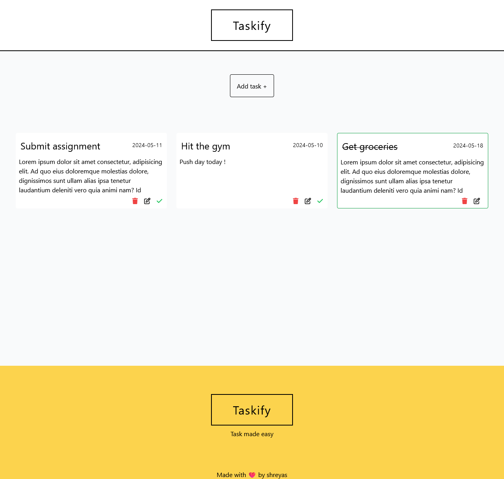

# Taskify
Taskify is a simple to-do application created with TypeScript and React. The design is straightforward and responsive. 

### Live application
[Taskify](https://taskify-five-neon.vercel.app/)

## About 
### Home

## Get started 
Fork the project, run:

### `npm install`

To run in your browser
Open [http://localhost:3000](http://localhost:3000)